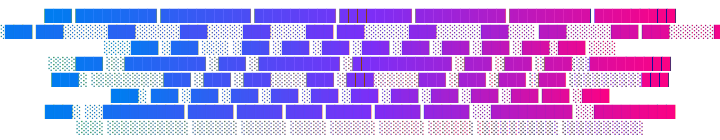

<p align="center">
  
</p>

<p align="center">
<em>multi-agent autonomous coding system for terminal</em>
</p>

<hr/>
<br/>

<p align="center">
  <!-- Tests & Quality -->
  <a href="https://github.com/SPTApyo/stratos-cli/actions/workflows/ci.yml"></a>
  <!-- Repository Versions -->
  <a href="https://pypi.org/project/stratos-core/"></a>
  <a href="https://aur.archlinux.org/packages/stratos-cli"></a>
  <!-- Platform & Usage -->
  <a href="https://pypi.org/project/stratos-core/"></a>
  <a href="https://pypi.org/project/stratos-core/"></a>
  <!-- Legal & Activity -->
  <a href="https://github.com/SPTApyo/stratos-cli/blob/main/LICENSE"></a>
  <a href="#"></a>
  <a href="https://github.com/SPTApyo/stratos-cli/commits/main"></a>
</p>

**Stratos** is a multi-agent autonomous coding system designed for the terminal. It orchestrates specialized AI agents to generate, modify, and execute code based on high-level specifications. By leveraging Google Gemini, Stratos bridges the gap between natural language requirements and functional software prototypes within a secure, industrial-grade sandbox.

## Features

- **Autonomous Agent Team**: Orchestrates Manager, Architect, Coder, and Reviewer roles for a complete development lifecycle.
- **Security Sandbox**: Strict execution layer that validates commands against safety policies to prevent destructive operations.
- **Premium TUI Dashboard**: High-density information display with real-time thought flow, task tracking, and execution logs.
- **Web-Enabled Search**: Equipped with DuckDuckGo search capabilities for up-to-date documentation and implementation context.
- **Universal Linux Support**: Native support for global installation on Arch Linux (AUR), Fedora (Copr), and standard distributions via PyPI.
- **Industrial Aesthetic**: Minimalist, premium, and efficient terminal interface with customizable themes.

## Documentation

- [Quickstart](#quickstart)
- [Installation Guide](#installation)
- [Command Line Usage](#usage)
- [System Architecture](./docs/architecture.md)
- [Custom Themes](./docs/themes.md) (Work in Progress)

## Compatibility

Stratos is designed to run on any modern terminal with **Unicode** support and **TrueColor (24-bit)** capabilities.

- **Shells**: Fully compatible with `bash`, `zsh`, `fish`, and `nushell`.
- **Operating Systems**: 
  - **Linux**: Native support (Arch, Fedora, Ubuntu/Debian).
  - **macOS**: Full support.
  - **Windows**: Supported via **WSL2** (Recommended) or standard PowerShell.

# Getting Started

Stratos requires **Python 3.10+** and a **Google Gemini API Key**.

## Installation

Choose the method that best fits your operating system:

### 🏔️ Arch Linux (AUR)
Install directly using your favorite AUR helper:
```bash
yay -S stratos-cli
```

### 🌀 Fedora / RHEL (Copr)
Enable the repository and install via DNF:
```bash
sudo dnf copr enable sptapyo/stratos-cli
sudo dnf install stratos-cli
```

### 🍎 macOS / 🐧 Other Linux (PyPI)
Install the core package using pip:
```bash
pip install stratos-core
```

### 🛠️ Manual Installation (Any System)
Recommended for contributors or local testing:
```bash
git clone https://github.com/SPTApyo/stratos-cli.git
cd stratos-cli
chmod +x install.sh
./install.sh # Select Option 1 for Global Install
```

## Setup & Launch

Once installed, simply run:
```bash
stratos
```
Upon first launch, you will be prompted for your **Google Gemini API Key**. It will be securely stored in `~/.config/stratos/.env`.

# Usage

```bash
# Start an interactive session
stratos

# Directly launch a project with specs
stratos -p MyProject -d "Create a responsive HTML/JS dashboard"

# Quick MVP testing mode (creates a clock)
stratos --quick
```

### Options
- `-p, --project NAME`: Directly launch a specific project.
- `-d, --desc TEXT`: Provide project description via CLI.
- `--theme NAME`: Override UI theme (e.g., `dracula_dark`, `nord_light`).
- `--debug`: Enable technical tracing and verbose logs.

# Security

Stratos executes code on your local machine. While it includes a security sandbox and command validation, users are advised to:
1. Review sensitive generated code before production use.
2. Run missions within isolated environments if processing untrusted requirements.

# Community

### GitHub
For bugs, feature requests, and contributions, please use the [Issue Tracker](https://github.com/SPTApyo/stratos-cli/issues).

### Discord
Our community server is currently under construction. Stay tuned for the official launch!

### Contributors

<a href="https://github.com/SPTApyo/stratos-cli/graphs/contributors">
  
</a>

Made with ❤️ by [SPTApyo](https://github.com/SPTApyo) and the community.

# License

This software is distributed under the **MIT License**. See [LICENSE](LICENSE) for details.

Copyright (c) 2026 SPTApyo
